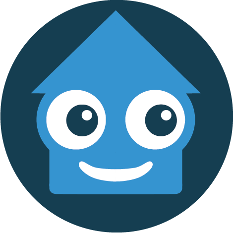
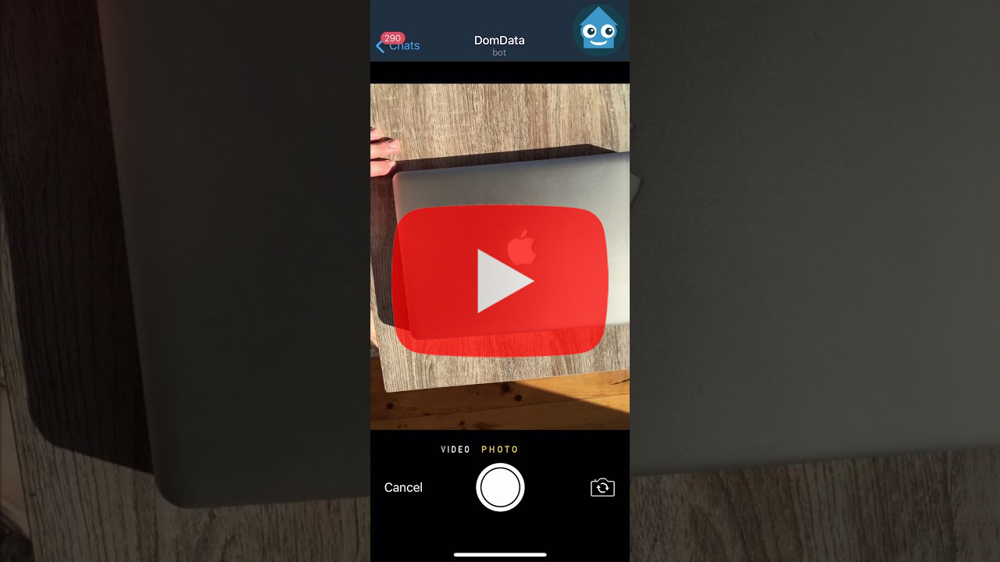

<p align="center">
 
</p>

# DomData

DomData is an effective household management tool. Create a virtual copy of your private house or office space to keep things organized easily. Perfect for private use in your apartment, country house or garage, as well as for businesses, warehouses, stores and offices.

## Demonstration
DomData chat bot is available on Telegram - <a href="https://t.me/domdatabot">https://t.me/domdatabot</a>

## Tutorial video
[](https://youtu.be/elQ4H_pMSEM "Watch DomData tutorial video")

## Features

* User-friendly interface implemented in chat bot functionality
* Object recognition (implemented with Imagga API)
* Reverse photo search, search by text, item class or emoji
* Houses can be shared between multiple users
* Multilingual user interface (English, Russian)
* User admin and premium privileges
* Flexible requests limits
* Items can be moved, renamed, highlighted, commented, marked as missing and etc
* Debug mode for testing
* Multi-Level logging
* Can send stickers:)

## Run the source code
You can run your version of DomData locally or on a cloud platform.

### Steps

* Clone the repository
* Copy **img** directory to your FTP server
* Create MySQL database (tables autocreation is coming soon)
* Register an <a href="https://imagga.com/auth/signup">Imagga account</a> and get your API key
* Create a new Telegram bot with <a href="https://t.me/BotFather">BotFather</a>
* Edit the configuration file. Rename **config.ini.example** to **config.ini** and replace example data to your credentials
* Install dependecies ```pip3 install -r requirements.txt``` 
* Run the app locally or on a cloud platform. 
